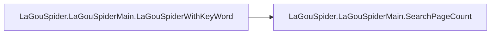

# Lagouspider Lagouspidermain

[_Documentation generated by Documatic_](https://www.documatic.com)

<!---Documatic-section-Codebase Structure-start--->
## Codebase Structure

<!---Documatic-block-system_architecture-start--->
```mermaid
None
```
<!---Documatic-block-system_architecture-end--->

# #
<!---Documatic-section-Codebase Structure-end--->

<!---Documatic-section-LaGouSpider.LaGouSpiderMain.SearchPageCount-start--->
## LaGouSpider.LaGouSpiderMain.SearchPageCount

<!---Documatic-section-SearchPageCount-start--->
<!---Documatic-block-LaGouSpider.LaGouSpiderMain.SearchPageCount-start--->
<details>
	<summary><code>LaGouSpider.LaGouSpiderMain.SearchPageCount</code> code snippet</summary>

```python
def SearchPageCount(position, city):
    url = 'http://www.lagou.com/jobs/positionAjax.json?'
    params = {'city': city, 'kd': position}
    url += parse.urlencode(params)
    with request.urlopen(url) as f:
        data = f.read()
        content = json.loads(str(data, encoding='utf-8', errors='ignore'))['content']
        count = int(content['totalPageCount'])
        totalCount = int(content['totalCount'])
        print('本次搜索到{0}个职位'.format(totalCount))
    return count
```
</details>
<!---Documatic-block-LaGouSpider.LaGouSpiderMain.SearchPageCount-end--->
<!---Documatic-section-SearchPageCount-end--->

# #
<!---Documatic-section-LaGouSpider.LaGouSpiderMain.SearchPageCount-end--->

<!---Documatic-section-LaGouSpider.LaGouSpiderMain.get_rdata-start--->
## LaGouSpider.LaGouSpiderMain.get_rdata

<!---Documatic-section-get_rdata-start--->
<!---Documatic-block-LaGouSpider.LaGouSpiderMain.get_rdata-start--->
<details>
	<summary><code>LaGouSpider.LaGouSpiderMain.get_rdata</code> code snippet</summary>

```python
def get_rdata(url):
    data = request.urlopen(url).read()
    params = parse.parse_qs(parse.urlparse(url).query)
    print('正在解析第{0}页...'.format(params.get('pn', [''])[0]))
    jsondata = json.loads(str(data, encoding='utf-8', errors='ignore'))['content']['result']
    for t in list(range(len(jsondata))):
        jsondata[t]['companyLabelListTotal'] = '-'.join(jsondata[t]['companyLabelList'])
        jsondata[t].pop('companyLabelList')
        if t == 0:
            rdata = DataFrame(Series(data=jsondata[t])).T
        else:
            rdata = pd.concat([rdata, DataFrame(Series(data=jsondata[t])).T])
    return rdata
```
</details>
<!---Documatic-block-LaGouSpider.LaGouSpiderMain.get_rdata-end--->
<!---Documatic-section-get_rdata-end--->

# #
<!---Documatic-section-LaGouSpider.LaGouSpiderMain.get_rdata-end--->

<!---Documatic-section-LaGouSpider.LaGouSpiderMain.LaGouSpiderWithKeyWord-start--->
## LaGouSpider.LaGouSpiderMain.LaGouSpiderWithKeyWord

<!---Documatic-section-LaGouSpiderWithKeyWord-start--->


### Object Calls

* LaGouSpider.LaGouSpiderMain.SearchPageCount

<!---Documatic-block-LaGouSpider.LaGouSpiderMain.LaGouSpiderWithKeyWord-start--->
<details>
	<summary><code>LaGouSpider.LaGouSpiderMain.LaGouSpiderWithKeyWord</code> code snippet</summary>

```python
def LaGouSpiderWithKeyWord(position, city):
    pageCount = SearchPageCount(position, city)
    if pageCount == 0:
        print('抱歉！在您搜索的城市中没有您要找的职位')
        return
    totaldata = DataFrame().T
    urls = []
    for i in range(0, pageCount):
        url = 'http://www.lagou.com/jobs/positionAjax.json?'
        params = {'city': city, 'kd': position, 'pn': i + 1}
        url += parse.urlencode(params)
        urls.append(url)
    pool = ThreadPool(processes=8)
    rdatas = pool.map(get_rdata, urls)
    for rdata in rdatas:
        totaldata = pd.concat([totaldata, rdata])
    totaldata.to_csv('lagou.csv')
```
</details>
<!---Documatic-block-LaGouSpider.LaGouSpiderMain.LaGouSpiderWithKeyWord-end--->
<!---Documatic-section-LaGouSpiderWithKeyWord-end--->

# #
<!---Documatic-section-LaGouSpider.LaGouSpiderMain.LaGouSpiderWithKeyWord-end--->

[_Documentation generated by Documatic_](https://www.documatic.com)